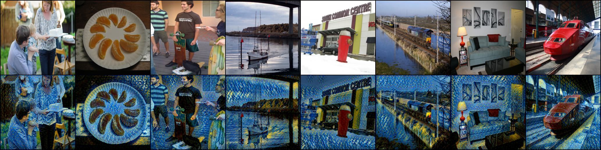
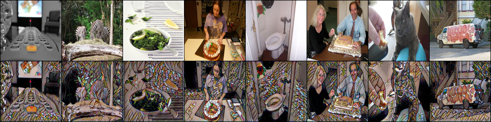

# Perceptual Losses for Real-Time Style Transfer

## Introduction

This is a simplified implementation of the paper "Perceptual Losses for Real-Time Style Transfer and Super-Resolution"[1], which mainly focus on the style transfer part. 

There are three main differences between my implementation and the one in the paper:

* I use the deep residual net as the image transform net (I think resnet is more easier and stable to train than the model structure proposed in [1]).
* I use the VGG19 as the loss network.
* I use only the style loss and content loss.

The training dataset are from [COCO dataset](https://cocodataset.org/#download) 2014 Train images.

## How to Run This Project
``` 
$ python train.py   # to train the model
$ python stylization # to get the stylized image from the pretrained model
```

## Results
> The outputs are generated in less than 1 second on RTX 3090 and Intel® Core™ i9-10900.

The input images are from [COCO dataset](https://cocodataset.org/#download) 2014 Val images.

### The Starry Night by Vincent van Gogh
<p align="center">
  
</p>

Results without cherry picking, the style_weight is set to 6e6 during traning:
<p align="center">
  
</p>


### Mosaic

Results without cherry picking, the style_weight is set to 3e6 during traning:
<p align="center">
  
</p>

<p align="center">
  
</p>
### 

## References

[1] Johnson, J., Alahi, A., & Fei-Fei, L. (2016). Perceptual Losses for Real-Time Style Transfer and Super-Resolution. arXiv. https://doi.org/10.48550/ARXIV.1603.08155